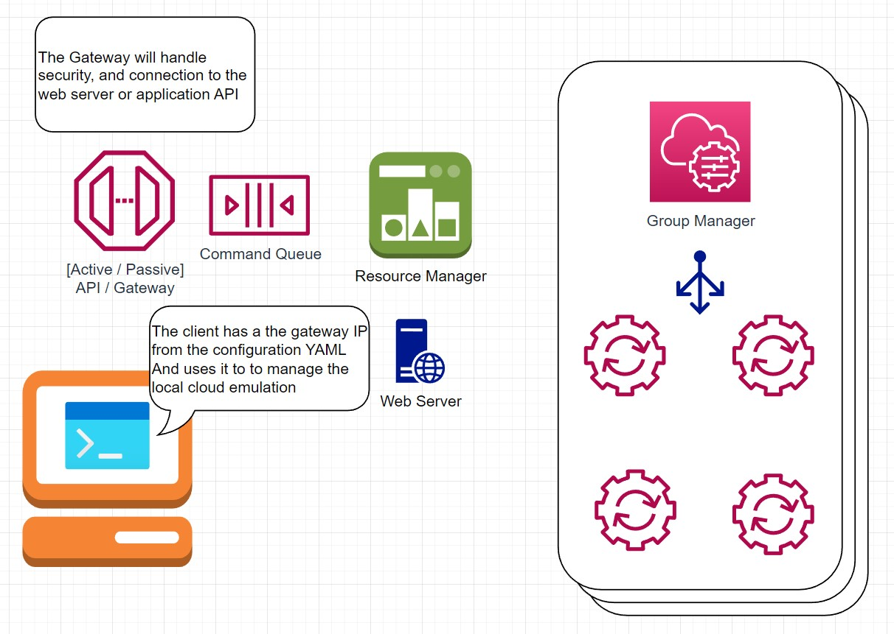

# Clumi - The Revolutionary Cloud Emulator for Developers

## Introduction
Clumi is a cloud emulator designed for developers, providing a local environment for testing and debugging cloud solutions. Clumi is compatible with most popular cloud providers such as AWS and Azure and requires minimal dependencies, making it accessible to developers of all skill levels. By using Clumi, developers can save money on cloud subscription fees and work more efficiently by testing their solutions in a local environment before deploying to the real cloud.

## Architecture Overview

The Clumi architecture consists of several key components, including:

### Gateway: 
The Gateway is responsible for managing incoming requests from users and routing them to the appropriate service.

### API Portal: 
The API Portal provides a centralized interface for accessing and managing cloud services, allowing developers to easily access and manage their cloud solutions.

### Service Orchestration Manager: 
This component is responsible for orchestrating and managing cloud services, resources, and subscriptions. It can be thought of as similar to the "Master" node in a Kubernetes cluster, as it performs similar functions such as monitoring the state of the system, ensuring resources are allocated and used optimally, and handling failures or issues that may arise. The Service Orchestration Manager provides a secure and scalable framework for managing cloud services, allowing developers to easily create and manage large, complex cloud solutions with confidence.

### Resources Manager: 
The Resources Manager is responsible for resource allocation, similar to the `resource groups` concept of cloud providers. It ensures that services and resources are deployed and configured correctly in each service group.

### Service: 
The Service component represents a specific cloud service that the user wants to emulate, such as cloud storage, compute, or databases. Services include properties such as name, type, and configuration.

## Data Model
The data model for Clumi is designed to be simple and intuitive, allowing developers to easily understand and work with their cloud solutions. The main components of the data model can be found [here](./DataModel/Overview.md)

## Conclusion
Clumi provides a powerful and flexible architecture for cloud development, allowing developers to easily test and debug their solutions in a local environment before deploying to the real cloud. With its simple and intuitive data model, flexible and extensible architecture, and integration with popular cloud providers, Clumi is a game-changing tool for cloud development.

For more information and to download Clumi, visit Clumi.co. Contact the Clumi team at info@clumi.co for additional support and assistance.
